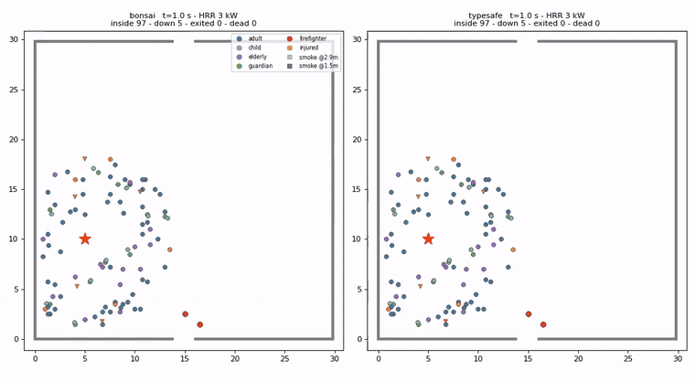

# TypeEvacSafe

**화재 피난자 한 사람 한 사람에게 판단 엔진을 하나씩 붙인 피난 시뮬레이터.**
판단은 타입 안전 판독(Jev 형식) — 상태와 질문과 선택지를 주면 **생성 없이 한 번의 순전파로 선택지 확률**을 읽는다.
이동은 검증된 소셜포스 모델(rust_evac BR)이 맡고, 화재장은 FDS-GPU 해석 결과를 쓴다.

> 개발: **Meteor Simulation** · 곧 **bulc.msimul.com** 과 화재 시뮬레이션 **BULC(불씨)** 에 기능으로 추가된다.
> 특허 출원 준비 중 — 아래 [라이선스와 특허](#라이선스와-특허) 참조.

<p align="center"></p>

*30×30 m 홀, 2 MW 화원(별표), 100명(성인 55·보호자 10·어린이 10·노약자 15·부상자 10[보행불능 5] + 소방관 2).
좌: 로컬 **Ternary Bonsai 2 27B (PQ2_0, 7.2 GB, 즉답 판독)**, 우: **TypeSafe Jev**.
t=1 s 부터 0.5 s 간격 211 프레임, 10 fps(실시간 5배속). 회색은 호흡선(1.5 m) 연기, 옅은 남보라는 천장(2.88 m) 연기, 주황은 60 °C 이상.
○ 이동 · ▽ 쓰러짐 · × 사망. 전체 영상: [`results/hall/bonsai_vs_jev.mp4`](results/hall/bonsai_vs_jev.mp4)*

---

## 무엇을 하려던 것인가

기존 피난 시뮬레이션은 모든 사람이 **최단 경로**로 가장 가까운 출구를 향한다. 실제 화재에서 사람이 하는 일 — 연기를 보고 돌아서고, 불이 난 출구를 버리고 먼 문으로 가고, 아이를 찾아 되돌아가고, 쓰러진 사람을 업고 나오고, 갈 데가 없으면 연기가 옅은 곳에 머무는 — 은 거기에 없다.

그래서 **판단과 이동을 나눴다**.

```
FDS-GPU 화재해석(.sf/.smv)
        ↓  convert_sf2d
2D 위험장: 온도 · 연기(K_s) · CO · O2 · 화염 · 출구별 거리장 · HRR(t) · 천장/호흡선/보행선 3층
        ↓
┌─────────────────────────────┬──────────────────────────────────────┐
│ 판단층 (사람마다 하나)        │ 물리층 (전부 공통)                     │
│ mode  피난/대기/아이동행/     │ 추진 (e₀·v₀−v)/τ · 벽·사람 반발       │
│       구조/군중추종/돌파/대피 │ 복사력(시선 제한) · 연기력 · 위험장 밀침 │
│ target_exit  출구 ≤8         │ Purser FED · Frantzich 감속           │
│ rescue_target / feasible    │ 시야 3/K_s → 길찾기 오차               │
│ pace  뛰기/걷기/천천히/정지   │ ASET 초과 후 10 s 노출 → 사망          │
│ survive  생존 확률           │ 쓰러진 사람·시신은 장애물로 남음        │
└─────────────────────────────┴──────────────────────────────────────┘
        ↓
0.5 s 간격 전원 좌표·상태·모드 CSV · 궤적 PNG · MP4 · 행동 평가 지표
```

개인 프로필이 결정과 물리 양쪽에 들어간다 — 성별·나이·역할(성인/어린이/노약자/보호자/부상자/소방관)·보행 불능·가족 링크(보호자↔아이). 속도·FED 민감도·복사 임계·시야 손실이 사람마다 다르다.

**핵심 주장**: 판단층은 학습 없이 규칙 프롬프트만으로 동작한다. 학습이 필요한 것은 정확도가 아니라 **처리량**(1,000명 × 판단 10회 = 1만 결정)이고, 그건 큰 모델의 결정을 작은 모델에 증류해서 푼다.

## 판단 백엔드 — 실측

A100 80 GB 1장 · 저작 벤치 20건(30 판정) · 지연은 **서로 다른 상황 20개**를 연속 질의해 측정(같은 프롬프트 반복 금지).
한 사람의 결정 = head 4~6개(mode / target_exit / rescue_target / rescue_feasible / pace / survive).

| 백엔드 | 크기 | 판독 | 정확도 | head당 | **결정당** |
|---|---|---|---|---|---|
| **TypeSafe Jev** (API) | — | 타입 확률 | 0.93 (28/30) | — | **0.085 s** (head 전부 한 요청) |
| **Qwen3.5-4B Q8_0** (openjev 방식) | 4.5 GB | 즉답 | 0.70 (21/30) | 0.128 s | **0.487 s** |
| **Ternary Bonsai 2 27B** PQ2_0 | 7.2 GB | 즉답 | **0.97** (29/30) | 0.467 s | **1.78 s** |
| Qwen3.8-27B UD-Q4_K_M | 16.5 GB | 생각 | 0.97 (29/30) | ~9 s | ~35 s |
| Qwen3.8-27B UD-Q4_K_M | 16.5 GB | 즉답 | 0.13 (4/30) | 0.13 s | 0.5 s |
| Qwen3.5-4B Q8_0 | 4.5 GB | 생각 | 0.57 (17/30) | 2.4 s | 9.5 s |

**같은 27B 베이스인데 삼진(Bonsai)은 생각 없이 0.97, 4비트(Q4)는 생각 없이 0.13.**
삼진 양자화가 로짓 판독에 훨씬 잘 맞는다 — 로컬에서 API 없이 판단 엔진을 돌릴 수 있는 이유다.

### 측정 시 주의 (우리가 실제로 밟은 함정)

1. **같은 프롬프트를 반복 측정하지 말 것.** llama.cpp `cache_prompt` 가 프롬프트 처리를 통째로 건너뛰어 3~5배 낙관적인 값이 나온다. 위 표는 전부 서로 다른 상황으로 쟀다.
2. **동시 요청이 오히려 느리다.** GPU 한 장에서는 계산 병목이고, 요청마다 KV 캐시(≈640 MiB)를 밀어내며 공용 시스템 프롬프트 접두 캐시까지 깨진다. 8스레드가 직렬보다 1.8배 느렸다.
3. **생각 모드는 즉답의 20~30배 느리고 판단을 획일화한다.** 백엔드 기본값은 `think=False`(즉답). Qwen3.8-27B Q4 처럼 즉답이 무너지는 모델에서만 `--think`.

### 100명 시나리오에서의 행동

| | 규칙 매크로(LLM 없음) | Qwen 27B(생각) | **Bonsai 2 27B(즉답)** | **TypeSafe Jev** |
|---|---|---|---|---|
| 탈출률 | 0.97 | 0.96 | 0.971 | 0.971 |
| 사망률 | 0.039 | 0.049 | **0.029** | **0.020** |
| 보행불능자(5명) 구조 | 2 | 1 | 2 | **5** |
| 부상자 탈출률 | 0.6 | 0.6 | 0.7 | 0.7 |
| 모드 엔트로피(개인차) | 0.21 | 0.05 | **0.50** | 0.42 |
| 나쁜 출구에서 더 나은 쪽 전환 | — | — | **0.54** | 0.00 |
| 소방관 역주행 깊이 | 4.2 m | 5.8 m | **6.4 m** | 0.0 m |
| 결정 수 · 판단 시간 합 | — | 30 · 1,050 s | 58 · 417 s | **42 · 5.7 s** |

같은 Bonsai 라도 **생각 모드로 돌리면 전원이 `evacuate` 한 가지**(엔트로피 0.00, 구조 0건)였고, 즉답으로 바꾸니 `evacuate 39 · escort 12 · rescue 7` 로 갈라지며 구조 2건·엔트로피 0.50 이 됐다. 생각 모드는 느리기만 한 게 아니라 판단을 뭉갠다.

## 설치

```bash
git clone https://github.com/using76/TypeEvacSafe && cd TypeEvacSafe
pip install -r requirements.txt          # torch, numpy, matplotlib
```

### (a) 로컬 — Ternary Bonsai 2 27B (API 없이, 권장)

```bash
# 전용 llama.cpp 포크 — 스톡 빌드는 파일을 읽고도 경고 없이 헛소리를 낸다
git clone --depth 1 https://github.com/PrismML-Eng/llama.cpp llama_prism && cd llama_prism
cmake -B build -DGGML_CUDA=ON -DLLAMA_CURL=OFF -DCMAKE_BUILD_TYPE=Release -DCMAKE_CUDA_ARCHITECTURES=80
cmake --build build -j 20 --target llama-server        # A100=80, Ada=89, Hopper=90
cd ..

bash scripts/get_models.sh bonsai      # Ternary-Bonsai-2-27B-PQ2_0.gguf (7.2 GB) → models/
#   파일 목록·대안(PTQ1_0 5.95 GB)은 models/README.md

LLAMA_SERVER=llama_prism/build/bin/llama-server bash scripts/serve_bonsai.sh 0 8083 models/Ternary-Bonsai-2-27B-PQ2_0.gguf
python typeevac/jev_bench.py --backend llama --url http://127.0.0.1:8083     # 즉답이 기본(--think 불필요)
```

### (b) 소형 로컬 — Qwen3.5-4B (openjev 방식, 가장 빠름)

```bash
bash scripts/get_models.sh qwen4b        # Qwen3.5-4B-Q8_0.gguf (4.5 GB)
bash scripts/serve_llm.sh 0 99 8082 models/Qwen3.5-4B-Q8_0.gguf
```

### (c) TypeSafe Jev API

```bash
echo -n "apikey_..." > ~/.typesafe_key   # 권한 600. 저장소에 넣지 말 것
```

### (d) 규칙 매크로 — LLM 없이 도는 기준선

## 쓰기

```bash
# 케이스 만들기: 파라메트릭 대공간 438종 / 판단 시험대 4종 / 실측 CAD·평면
python typeevac/gen_bigspace_v2.py cases/
python typeevac/gen_judgment.py    cases/        # J1~J4: 최단 경로가 '오답'인 배치
python typeevac/prep_cad.py your_building.fds cases/MY --fire near_exit --ceiling

# FDS-GPU 해석 + 위험장 변환 (z = 0.5 / 1.5 / 2.4 / 2.8 m, 9채널)
python typeevac/gen_queue.py --gpu 0 --shard 0/1 --only J1_,J2_

# 100명 홀 시험 — 판단층 비교, 0.5 s 좌표 CSV
python typeevac/hall_test.py --case HALL_30x30_2MW --macro rule,llama --url http://127.0.0.1:8083 --out runs/hall
#   --think 를 붙이면 생각 모드(느리다; Qwen3.8-27B Q4 에만 필요)

# 행동 평가 — '몇 명 나갔나'가 아니라 '읽고 짰나, 역할을 했나'
python typeevac/jev_eval.py --run runs/hall --macro rule,llama --field fields/HALL_30x30_2MW.npz

# 2 s PNG + MP4(천장·호흡선 연기 오버레이)
python typeevac/hall_frames.py --out runs/hall --macro llama,typesafe --every 2 --t_min 1 \
       --mp4 compare.mp4 --video_every 0.5 --fps 10
```

## 평가 축 (탈출률이 아니라)

| 축 | 지표 |
|---|---|
| A 상황 인지 | 위험이 닥친 뒤 결정 변경률·지연, 경로 노출 후회, 개선 스위치 비율, 나쁜 출구에서 전환율 |
| B 경로 계획 | 우회율, 연기 노출 p50/p90 |
| C 역할 수행 | 보호자–아이 분리 시간·동반 탈출, 소방관 역주행 깊이, 부상자·보행불능자 구조/사망 |
| D 자율성 | 같은 케이스에서 모드·목표 출구 엔트로피(획일적이지 않은가) |

100명이 전부 나가는 것이 목표가 아니다. **각자가 자기 상황을 읽고 자기 역할을 하는가**가 목표다.

## 로드맵

1. **head 묶음 요청** — 지금은 head 마다 요청을 보내 같은 상황 텍스트를 4~6번 다시 읽는다. Jev 처럼 한 요청에 묶으면(또는 상태 프리필 공유) 로컬 백엔드가 3~4배 빨라진다.
2. **증류** — Jev/Bonsai 결정 확률을 교사로 Qwen3.5-4B LoRA(옵션 KL). 목표 벤치 ≥ 0.93, 0.05 s/결정.
3. **결과 보정** — 결정점 후보를 전수 롤아웃해 실제 결과(탈출·사망·구조)로 가중 갱신.
4. **확률 보정** — `survive`·`rescue_feasible` 온도 스케일링 + ECE.
5. 1,000명 처리량, RiMEA/IMO 동역학 검증, BULC(불씨) 통합.

## 출처

- 판독 방식: [TheoLeeCJ/openjev](https://github.com/TheoLeeCJ/openjev) (MIT) — 생성 없이 옵션 글자 로짓만 읽는 방법
- head fan-out·실행 가드: [browser-use/jev-ultrafast](https://github.com/browser-use/jev-ultrafast) (MIT)
- 로컬 모델: [Ternary Bonsai 2 27B](https://huggingface.co/prism-ml/Ternary-Bonsai-2-27B-gguf) (Apache-2.0, PrismML) · [Qwen3.5-4B](https://huggingface.co/Qwen) (Apache-2.0)
- 보행 동역학·FED: rust_evac (Meteor Simulation) · 화재장: FDS-GPU(BULC) / NIST FDS
- 모델 파일 이름·내려받기: `models/README.md`, `scripts/get_models.sh`

## 라이선스와 특허

소스는 **PolyForm Noncommercial 1.0.0** — 연구·평가·비상업 용도는 자유, 상업적 사용은 별도 계약.
이 선택은 **특허 출원을 준비 중이기 때문**이다. Apache-2.0 은 기여자·배포자가 사용자에게 **명시적 특허 실시권**을 주므로 출원 예정 기술을 공개 배포하면 권리 행사가 막힌다. MIT 는 명시 조항은 없지만 배포한 코드에 대한 묵시적 실시권 주장 여지가 남는다.

상업 문의·라이선스: Meteor Simulation (bulc.msimul.com)
